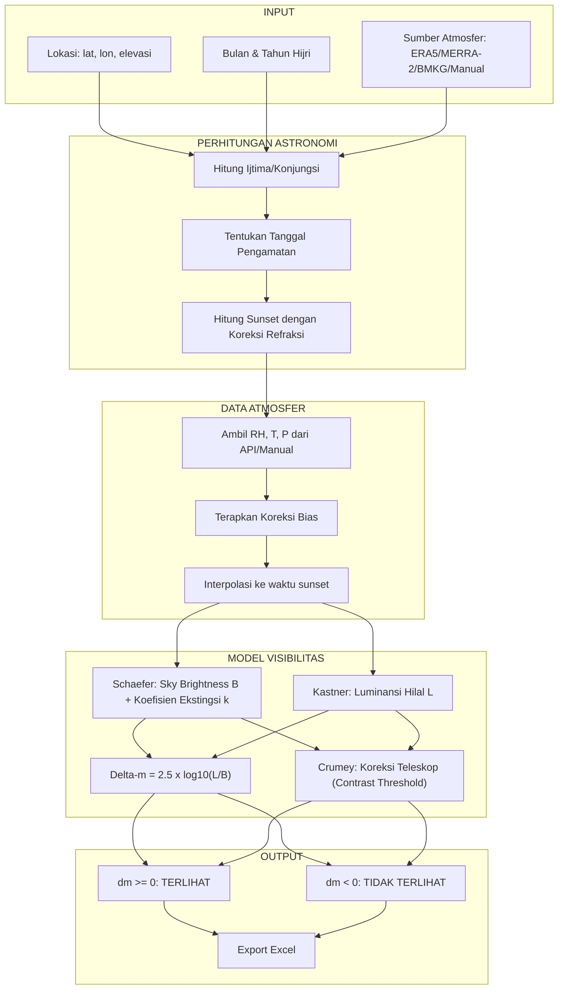

# Perhitungan Visibilitas Hilal

## Kombinasi Model Schaefer dan Kastner Berbasis Data Reanalisis Atmosfer


---

## 1. Pendahuluan

Program ini menghitung visibilitas hilal dengan mengintegrasikan:

- **Model Schaefer** untuk sky brightness dan koefisien ekstingsi
- **Model Kastner** untuk luminansi hilal dan delta m
- **Model Crumey** untuk koreksi visibilitas teleskop
- **Data Reanalisis Atmosfer** dari ERA5, MERRA-2, BMKG, atau input manual

---

## 2. Kebaruan Penelitian

### Perbandingan dengan Penelitian Sebelumnya

| Aspek                             | Penelitian Sebelumnya                              | Program Ini                                                              |
| --------------------------------- | -------------------------------------------------- | ------------------------------------------------------------------------ |
| **Sky Brightness**          | Diperoleh dari website (algoritma tidak diketahui) | Dihitung menggunakan **model Schaefer** dengan algoritma transparan |
| **Koefisien Ekstingsi (k)** | Menggunakan nilai asumsi (misal k=0.5)             | Dihitung berdasarkan **parameter atmosfer aktual** (RH, T, P)       |
| **Luminansi Hilal**         | Model Kastner dengan k asumsi                      | Model Kastner dengan **k hasil perhitungan Schaefer**               |
| **Data Atmosfer**           | Tidak ada / asumsi standar                         | Data **reanalisis ERA5 dan MERRA-2** dengan interpolasi temporal    |
| **Visibilitas Teleskop**    | Koreksi sederhana (Schaefer 1990)                  | Model terintegrasi **Schaefer-Crumey** dengan contrast threshold    |

### Kontribusi Utama

> **Kebaruan penelitian ini terletak pada perhitungan koefisien ekstingsi atmosfer secara akurat menggunakan rumus model Schaefer, yang mempertimbangkan parameter atmosfer aktual (suhu, kelembaban, tekanan) dari data reanalisis, bukan berdasarkan asumsi.**

### Rumus Ekstingsi yang Dihitung (Bukan Asumsi)

Program ini menghitung **4 komponen ekstingsi** secara terpisah:

```
K_total = K_R (Rayleigh) + K_A (Aerosol) + K_O (Ozon) + K_W (Uap Air)
```

| Komponen | Variabel yang Digunakan      | Rumus                                                  |
| -------- | ---------------------------- | ------------------------------------------------------ |
| $K_R$  | Elevasi (H), Wavelength (λ) | $0.1066 \cdot e^{-H/8200} \cdot (\lambda/0.55)^{-4}$ |
| $K_A$  | **RH**, Elevasi, Musim | $\propto (1 - 0.32/\ln(RH/100))^{1.33}$              |
| $K_W$  | **RH, T**, Elevasi     | $\propto RH \cdot e^{T/15} \cdot e^{-H/8200}$        |
| $K_O$  | Lintang, Musim               | Variasi musiman lapisan ozon                           |

---

## 3. Requirements & Dependencies

### System Requirements
- **Python**: 3.8 atau lebih tinggi
- **OS**: Windows, Linux, atau macOS
- **Memory**: Minimal 4GB RAM (8GB direkomendasikan)
- **Storage**: ~50MB untuk ephemeris dan cache

### Python Packages

```bash
pip install -r requirements.txt
```

Atau install manual:

```bash
# Core dependencies
pip install numpy>=1.20.0
pip install pandas>=1.3.0
pip install openpyxl>=3.0.0

# Astronomical calculations
pip install skyfield>=1.45.0

# Weather API requests
pip install requests>=2.26.0
pip install openmeteo-requests>=1.1.0
pip install requests-cache>=1.0.0
pip install retry-requests>=2.0.0

# Timezone handling
pip install pytz>=2021.1
```

### Files Required
- `de440s.bsp` - JPL Ephemeris (sudah termasuk, ~32MB)

---

## 4. Installation

### Step 1: Clone/Download Repository
```bash
git clone <repository-url>
cd crescent_visibility/Core
```

### Step 2: Install Dependencies
```bash
pip install -r requirements.txt
```

### Step 3: Verify Installation
```bash
python -c "import skyfield; import numpy; import pandas; print('All dependencies installed')"
```

### Step 4: Run Program
```bash
python core_crescent_visibility.py
```

---

## 5. Struktur Program

```
Core/
├── core_crescent_visibility.py      # Program utama (unified, semua sumber atmosfer)
├── visual_limit_schaefer.py         # Sky brightness & koefisien ekstingsi (model Schaefer)
├── visual_limit_kastner.py          # Luminansi hilal & delta m (model Kastner)
├── crumey.py                        # Fungsi dasar model Crumey (contrast threshold)
├── crumey_telescope_correction.py   # Integrasi model Schaefer-Crumey untuk teleskop
├── telescope_limit.py               # Ambang batas visibilitas hilal teleskop
├── atmosfer_era5.py                 # API Open-Meteo ERA5 (data reanalisis 1940-sekarang)
├── atmosfer_merra2.py               # API NASA POWER MERRA-2 (data reanalisis 1981-sekarang)
├── atmosfer_bmkg.py                 # API BMKG (prakiraan cuaca 3 hari ke depan)
├── data_hisab.py                    # Perhitungan astronomi (ijtima, posisi matahari/bulan)
├── daftar_lokasi.py                 # Database lokasi pengamatan
├── de440s.bsp                       # Ephemeris JPL (~32MB)
└── output/                          # Direktori output file Excel
```

---

## 6. Diagram Alur Algoritma



---

## 7. Model Schaefer (Sky Brightness)

### 7.1 Koefisien Ekstingsi

$$
K = K_R + K_A + K_O + K_W
$$

| Komponen           | Rumus                                                  | Pengaruh        |
| ------------------ | ------------------------------------------------------ | --------------- |
| $K_R$ (Rayleigh) | $0.1066 \cdot e^{-H/8200} \cdot (\lambda/0.55)^{-4}$ | Elevasi         |
| $K_A$ (Aerosol)  | $\propto (1 - 0.32/\ln(RH/100))^{1.33}$              | **RH**    |
| $K_W$ (Uap Air)  | $\propto RH \cdot e^{T/15}$                          | **RH, T** |
| $K_O$ (Ozon)     | Faktor musiman                                         | Lintang         |

### 7.2 Airmass

$$
X = \frac{1}{\cos(z) + 0.025 \cdot e^{-11 \cdot \cos(z)}}
$$

### 7.3 Sky Brightness (nanoLambert)

$$
B_{sky} = B_N + B_M + B_T
$$

Dimana $B_N$ = dark sky, $B_M$ = moonlight, $B_T$ = twilight

---

## 8. Model Kastner (Luminansi Hilal)

### 8.1 Magnitudo Visual Bulan

$$
m_v = 0.026 \cdot \alpha + 4 \times 10^{-9} \cdot \alpha^4 - 12.73
$$

### 8.2 Luas Sabit

$$
A = \frac{1}{2} \pi r^2 \cdot [1 + \cos(180° - \varepsilon)]
$$

### 8.3 Luminansi (nanoLambert)

$$
L = 0.263 \cdot \frac{2.51^{(10-m_v)}}{A} \cdot e^{-kX}
$$

---

## 9. Perhitungan Delta-m

$$
\Delta m = 2.5 \cdot \log_{10}\left(\frac{L}{B_{sky}}\right)
$$

| Nilai Dm | Status                   |
| --------- | ------------------------ |
| Dm > 0   | **TERLIHAT**       |
| Dm <= 0  | **TIDAK TERLIHAT** |

---

## 10. Koreksi Teleskop (Model Terintegrasi Schaefer-Crumey)

Program ini menggunakan model terintegrasi Schaefer-Crumey untuk menghitung visibilitas teleskop, yang mempertimbangkan:

| Faktor                | Keterangan                                    |
| --------------------- | --------------------------------------------- |
| Aperture              | Diameter lensa objektif teleskop              |
| Magnification         | Pembesaran teleskop                           |
| Central Obstruction   | Obstruksi pusat (untuk reflektor)             |
| Transmission          | Transmisi per permukaan optik                 |
| Contrast Threshold    | Ambang kontras berdasarkan model Crumey       |
| Observer Age          | Usia pengamat (mempengaruhi ukuran pupil)     |
| Seeing                | Ukuran seeing disk atmosfer (arcseconds)      |

Visibilitas teleskop dihitung berdasarkan **margin** antara Weber contrast objek dan contrast threshold Crumey:

$$
\text{Margin} > 0 \Rightarrow \text{TERDETEKSI}
$$

---

## 11. Sumber Data Atmosfer

Program mendukung 4 sumber data atmosfer:

| Sumber            | Endpoint                       | Variabel             | Jangkauan           |
| ----------------- | ------------------------------ | -------------------- | ------------------- |
| **ERA5**    | `archive-api.open-meteo.com` | RH2M, T2M, Pressure | 1940 - sekarang     |
| **MERRA-2** | `power.larc.nasa.gov`        | RH2M, T2M, PS       | 1981 - sekarang     |
| **BMKG**    | API BMKG Prakiraan             | RH, T                | 3 hari ke depan     |
| **Manual**  | Input pengguna                 | RH, T, P             | Bebas               |

---

## 12. Penggunaan

### 12.1 Mode Interaktif (CLI)

```bash
python core_crescent_visibility.py
```

Program akan memandu pengguna melalui langkah-langkah:
1. Pilih lokasi pengamatan (dari database atau input manual)
2. Input bulan dan tahun Hijriah
3. Pilih mode perhitungan (sunset / optimal)
4. Pilih sumber data atmosfer (ERA5 / MERRA-2 / BMKG / Manual)
5. Konfigurasi koreksi bias (opsional)
6. Konfigurasi parameter teleskop (opsional)
7. Simpan hasil ke Excel (opsional)

### 12.2 Penggunaan sebagai Library

```python
from core_crescent_visibility import HilalVisibilityCalculator

calc = HilalVisibilityCalculator(
    nama_tempat="UIN Walisongo",
    lintang=-6.917,
    bujur=110.348,
    elevasi=89,
    timezone_str="Asia/Jakarta",
    bulan_hijri=9,
    tahun_hijri=1444,
    sumber_atmosfer='era5'      # 'era5', 'merra2', 'bmkg', atau 'manual'
)

hasil = calc.jalankan_perhitungan_lengkap(
    use_telescope=True,
    aperture=100.0,
    magnification=50.0,
    mode="optimal",             # 'sunset' atau 'optimal'
    interval_menit=2,
    min_moon_alt=2.0
)

# Simpan ke Excel
calc.simpan_ke_excel("output/hasil_ramadhan_1444.xlsx")
```

### 12.3 Parameter Input Manual Atmosfer

```python
calc = HilalVisibilityCalculator(
    nama_tempat="Lokasi Uji",
    lintang=-6.917,
    bujur=110.348,
    elevasi=89,
    timezone_str="Asia/Jakarta",
    bulan_hijri=9,
    tahun_hijri=1444,
    sumber_atmosfer='manual',
    manual_rh=75.0,             # Relative Humidity (%)
    manual_t=28.0,              # Suhu (°C)
    manual_p=1013.25            # Tekanan (mbar)
)
```

---

## 13. Contoh Output

### 13.1 Output Terminal

```
======================================================================
HASIL PERHITUNGAN VISIBILITAS HILAL
======================================================================

============================== LOKASI ===============================
  Nama Tempat           : UIN Walisongo
  Lintang               : -6.917°
  Bujur                 : 110.348°
  Elevasi               : 89 m
  Timezone              : Asia/Jakarta

============================== WAKTU ================================
  Ijtima UTC            : 2023-03-21 17:23:08
  Ijtima Lokal          : 2023-03-22 00:23:08
  Tanggal Pengamatan    : 2023-03-22
  Sunset Lokal          : 2023-03-22 17:42:15

============================ DATA ATMOSFER ==========================
  Kelembapan Relatif (RH)   : 78.00%  (bias=0.0%)
  Suhu (T)                  : 28.50°C  (bias=0.0°C)
  Tekanan Udara (P)         : 1003.12 mbar
  Koefisien Ekstingsi (k_V) : 0.3456

====================== VISIBILITAS HILAL NAKED EYE ==================
  Luminansi Hilal       : 1.2345e+03 nL
  Sky Brightness        : 2.3456e+03 nL
  Rasio Kontras (R)     : 5.2632e-01
  Delta m               : -0.3400
  Status                : TIDAK TERLIHAT

======================== VISIBILITAS HILAL TELESKOP ==================
  Luminansi (Teleskop)  : 4.5678e+02 nL
  Sky Bright. (Teleskop): 1.2345e+02 nL
  Weber Contrast (C_obj): 3.7012e+00
  Threshold (Crumey)    : 1.2345e+00
  Visib. Margin (D_m)   : 0.2800
  Status                : TERLIHAT
```

### 13.2 Excel Output

File Excel berisi 3 worksheet:
- **Ringkasan**: Seluruh data summary (lokasi, waktu, atmosfer, posisi, visibilitas)
- **Timestep Data**: Data per-timestep (jika mode optimal)
- **Info Program**: Metadata program dan versi

---

## 14. Troubleshooting

### Error: "No module named 'skyfield'"
**Solusi**:
```bash
pip install -r requirements.txt
```

### Error: "Connection timeout" saat ambil data cuaca
**Solusi**:
- Cek koneksi internet
- Pastikan API endpoint tidak sedang down:
  - `https://archive-api.open-meteo.com` (ERA5)
  - `https://power.larc.nasa.gov` (MERRA-2)
- Coba gunakan sumber atmosfer 'manual' jika API tidak accessible

### Error: "File not found: de440s.bsp"
**Solusi**:
- Pastikan file `de440s.bsp` ada di direktori `Core/`
- Download ulang dari JPL jika corrupt

### Warning: "Cache expired" di `.cache.sqlite`
**Info**: Normal, cache akan otomatis refresh. Tidak perlu action.

### Hasil perhitungan berbeda jauh dari ekspektasi
**Troubleshoot**:
1. Cek timezone setting: gunakan format `Asia/Jakarta`
2. Verifikasi koordinat lokasi (lintang/bujur)
3. Pastikan bulan/tahun Hijri benar
4. Cek kualitas data atmosfer (RH/T tidak ekstrem)

### Error: "Permission denied" saat write Excel
**Solusi**:
```bash
# Windows: run sebagai Administrator
# Linux/macOS:
chmod +w output/
```

---

## 15. Referensi

1. Schaefer, B.E. (1991). "Telescopic Limiting Magnitudes." *PASP*, 103, 645-660.
2. Schaefer, B.E. (1993). "Astronomy and the Limits of Vision." Vistas in Astronomy, 36, 311-361.
3. Reijs, V. "Schaefer's Visual Limiting Magnitude Calculator." Archaeocosmology Website.
4. Schaefer, Brad E. (2000) "New methods and techniques for historical astronomy and archaeoastronomy." In: Archaeoastronomy: The journal of astronomy in culture, XV, 121-135.
5. Kastner, S.O. (1976). "Calculation of the Twilight Visibility." *JBAA*, 86(4), 350-359.
6. Crumey, A. (2014). "Human contrast threshold and astronomical visibility." *MNRAS*, 442(3), 2600-2619.
7. Hersbach, H., et al. (2020). "The ERA5 global reanalysis." *QJRMS*, 146, 1999-2049.
8. Gelaro, R., et al. (2017). "MERRA-2." *Journal of Climate*, 30(14), 5419-5454.
